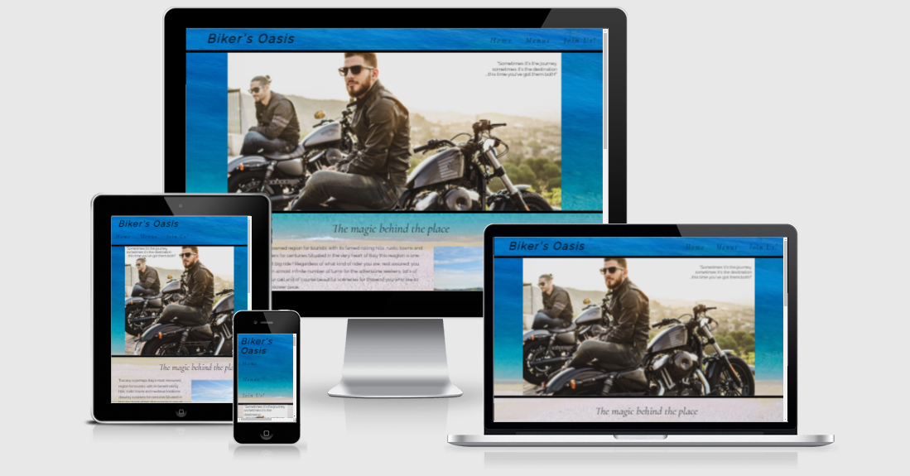

# Biker's Oasis

The idea behind this website is to offer a place to gather for people sharing a commong passion -> motorcycles. It starts with a bit of a display of the Tuscany reagion, very famous among bikers due to it's perfect trails and views. Moving on, it introduces the viewer to the location of the place and gives him some small dettails regarding it. The website also provides information regarding the times and how to get in contact with the location and as well some information regarding the menus of the place.

## Features 

In this section, you should go over the different parts of your project, and describe each in a sentence or so. You will need to explain what value each of the features provides for the user, focusing on who this website is for, what it is that they want to achieve and how your project is the best way to help them achieve these things.

### Existing Features

- __Navigation Bar__

  - Featured on all three pages, the full responsive navigation bar includes links to the Logo, Home page, Menus and Sign Up page and is identical in each page to allow for easy navigation.
  - This section will allow the user to easily navigate from page to page across all devices without having to revert back to the previous page via the ‘back’ button. 

- __The landing page image__

  - This section introduces the user to the website with a nice image picturing two bikers enjoying the sunset after a long ride. this image is meant to creat a bond with the viewer by displaying a comon passion.
  - The landing includes a paragraph with a motivational quote in order to further deepen that bond and as well it wants to deliver a small preview of what the website is about

- __About the area__

  - This section will allow the user to have a brief intro to the region the location i situated in displaying fetures higly valued by bikers such as nice wavy streets and beautiful landscapes

- __About the location__

  - This section will allow the user to see what he will find upon reaching the location:
  a place to not only drink and eat but as well to share stories and meet an one big family made up by likeminded people sharing comon passions

- __Opening Times section__

  - This section will allow the user to see the exact times the trattoria will be open as well as providing means to get in contact with the owners

- __The Footer__ 

  - The footer section includes links to the relevant social media sites for Biker's Oasis. The links will open to a new tab to allow easy navigation for the user. 
  - The footer is valuable to the user as it encourages them to keep connected via social media

- __Menus__

  - The menus area will provide the user with valuable information about what kind of food and drinks 
    they will be able to find upon reaching the location.
  - It's split in two diferent areas in order to give a clear and distinct vision of food (top side) and beverages (at the bottom). 

- __The Sign Up Page__

  - This page will allow the user to get signed up to Biker's Oasis as a way to stay in contact with the location and updated about possible events and meetups. The user will be able specify whhat kind of motorcycle the prefer and what made them like the place. The user will be asked to submit their full name and email address. 

## Testing 

The website deployment was tested on the folowing browsers wothout incuring in any kind of notable errors:
- Google Chrome
- Microsoft Edge
- Avast Secure Browser
- Safari mobile browser (iphone 6SE)

### Validator Testing 

- HTML
  - No errors were returned when passing through the official [W3C validator]()
- CSS
  - No errors were found when passing through the official [(Jigsaw) validator]()
 

## Deployment

- The site was deployed to GitHub pages. The steps to deploy are as follows: 
  - In the GitHub repository, navigate to the Settings tab 
  - From the source section drop-down menu, select the Master Branch
  - Once the master branch has been selected, the page will be automatically refreshed with a detailed ribbon display to indicate the successful deployment. 

The live link can be found here -  https://valyx.github.io/Oasis_v2.0/

## Bugs:
    For some reson my code works perfectly (the code regarding the table's overflow on smaller devices) when i'm testing it on the debbuging tool but it doesn't seem to work one amireponsive website/when i access it from my phone. The code was updated to github and should be using the latest verion on external websites as well but for some reason it doesn't appear to work. I will add an image as proof of the fact that during the testing the code was working fine (see below):
    
## Credits 

### Content 

- Used a readme content from the Love Running as a template in order to create mine
- Instructions on how to implement the horizontal bar for the tabel were got from here: https://stackoverflow.com/questions/4237110/how-can-i-make-a-css-table-fit-the-screen-width/19185177
- i've learned how to use flexboxes during the period that i was working at my second project (even tho the styling of the signup area changed meanwhile and there's no more a real need for a flex box i still wanted to mention it here since i've left the display of that area setupped by using a flex box). In order to learn them i've folowed this tutorial - https://www.youtube.com/watch?v=vQAvjof1oe4&t=493s and as well played around with the in-build function that pops up when using chrome's debugger
- The code for the footer was done by following the Love Running project example
- The icons in the footer were taken from [Font Awesome](https://fontawesome.com/)
- The fonts were taken from https://fonts.google.com/
- Other knowledge was gathered from https://www.w3schools.com/ and https://stackoverflow.com/

### Media

- The image used for as background image for the main and menus pages come from the https://pixabay.com/ open source website
- The rest of the images used in my project come the the https://unsplash.com/ open source website

